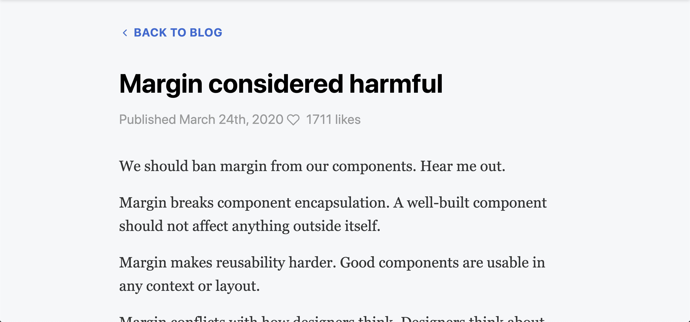
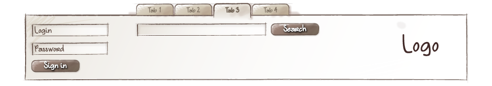

theme: Fira, 3
slidenumbers: true

# Full BEM stack

#### write CSS like it's 2015

---

---

[.background-color: #fff]

---
[.text: Avenir Next Regular]

# BEM Methodology

Blocks can be moved around on a page, moved between pages or projects. The implementation of blocks as independent entities makes it possible to change their position on the page and ensures their proper functioning and appearance.[^2]

[^2]: https://en.bem.info/methodology/key-concepts/

---

> Those who cannot remember the past are condemned to repeat it
— George Santayana

---

# Links

- http://getbem.com
- https://en.bem.info